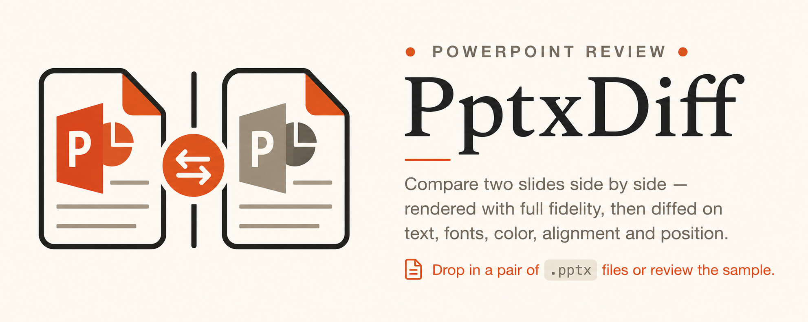

# **`PptxDiff`** — _A Diff Tool for Slides_

<!-- markdownlint-disable MD041 -->
[][#npm-package-url]
[![vscode-badge][#vsce-svg-url-version]][#vsce-marketplace-url] [][#docs-package]
<!---
[![Installs][#vsce-svg-url-installs]][#vsce-marketplace-url]
[![Downloads][#vsce-svg-url-downloads]][#vsce-marketplace-url]
--->
[#vsce-svg-url-version]: https://vsmarketplacebadges.dev/version/sugatoray.pptxdiff-vscode.svg
<!---
[#vsce-svg-url-installs]: https://vsmarketplacebadges.dev/installs/sugatoray.pptxdiff-vscode.svg
[#vsce-svg-url-downloads]: https://vsmarketplacebadges.dev/downloads/sugatoray.pptxdiff-vscode.svg
--->
[#vsce-marketplace-url]: https://marketplace.visualstudio.com/items?itemName=sugatoray.pptxdiff-vscode

[#npm-package-url]: https://www.npmjs.com/package/pptxdiff

[#docs-package]: https://sugatoray.github.io/pptxdiff/
<!-- markdownlint-enable MD041 -->



---

> [!warning] 
> :warning: **_THIS PROJECT IS BEING DEVELOPED RAPIDLY. FEATURES MAY BREAK OR YOU MAY FIND BUGS AS THIS IS IN EARLY STAGE OF DEVELOPMENT_**.

---

## What is `pptxdiff`?

A single-file, client-side tool for comparing two PowerPoint decks (or many pairs at once), rendered with real fidelity and diffed on text, formatting, images, tables, charts, animations, transitions, speaker notes, and more — with a full reviewer workflow (approvals, comments, history) built in.

No build step, and no install required if you'd rather just open `index.html` directly — or install it as a CLI via npm.


## Features

- **High-fidelity rendering** — real `.pptx` parsing (OOXML) plus `@aiden0z/pptx-renderer` for pixel-accurate slide previews, with a schematic fallback if a part can't be rendered.
- **Deep diffing** — text (word-level highlighting), fonts, color, alignment, position, shape borders, wrap, hyperlinks (text-run and shape-level), images/charts (content + position), tables (cell text, background, borders), backgrounds, animations, transitions, speaker notes (text *and* formatting), embedded fonts, slide master/layout inheritance, section headers.
- **Deck-level comparison** — not just 1:1 pairs: content-similarity alignment handles inserted/removed/reordered slides, with ADDED / DELETED / MOVED / CHANGED / IDENTICAL status tags (stackable — a slide can be both MOVED and a DUPLICATE).
- **Duplicate detection** — same-deck near-duplicate slides, and cross-deck duplicates (a Before slide resembling a different, unaligned After slide), with an adjustable sensitivity threshold, a performance cap for large decks, and a per-pair ignore list.
- **Reviewer workflow** — multiple reviewers (@handle/email + name), per-slide and per-diff Approve/Reject (with rollups), threaded comments (add/reply/delete, single and bulk), an approval history log, and scoped "clear decisions" (all / just mine / a specific reviewer / a slide range) — all backed by a single shared confirmation-modal component for every destructive action.
- **Batch mode** — compare many deck pairs at once (order- or filename-matched), with per-pair diff counts and cross-deck duplicate counts.
- **Three-way merge** — per-diff Keep-Before/Keep-After/Custom picks, a per-slide winner override, a merge-winner preview, and a real (beta) merged `.pptx` export (text/tables/background/notes/transitions; images/charts are not re-embedded).
- **Exports** — PDF, standalone HTML report, JSON (with a `uiState` block for round-trip re-import — merge or overwrite an in-progress session), CSV/JSON decisions, Markdown summary, Notion-flavored Markdown, Confluence wiki markup, and live push attempts to Slack (webhook), Notion (API), and Confluence (API) — the latter two typically blocked by browser CORS outside a backend proxy, and fail gracefully with the file-based export as a fallback.
- **Keyboard shortcuts** (press `?` for the full list) and a touch-friendly batch-file reorder (drag-and-drop with a touch ghost preview).
- **Dark mode**, localStorage persistence (reviewer state; live-push credentials are opt-in, per-field).
- **Self-tests** — an in-browser Red/Green regression suite (`Run self-tests` button) covering the diff engine, alignment, duplicate detection, merge logic, and a static-analysis guard against stale method references.

## Getting started

### Option A — npx (no install)

```bash
npx pptxdiff
```

Starts a local server and opens the app in your default browser.

### Option B — npm (global install)

```bash
npm install -g pptxdiff
pptxdiff
```

### Option C — just the file (no npm at all)

```bash
git clone https://github.com/sugatoray/pptxdiff.git
cd pptxdiff
open src/pptxdiff/index.html   # or just double-click it / serve the folder statically
```

The app ships with a built-in sample deck (`sample-pptx.js` generates it on load) so you can try every feature immediately — no files to upload. Drop in your own `.pptx` pair, or click **Reset to sample**.

Note: the app is fully offline-capable — React, ReactDOM, Babel, JSZip, `@aiden0z/pptx-renderer`, and the Spectral font are all vendored locally under `src/pptxdiff/vendor/` and loaded from disk, not from a CDN. No internet connection is required to run it, for any of the options above. Set `PPTXDIFF_LITE_MODE=1` (or append `?lite=1` to the URL) to opt back into CDN sourcing instead — see `bin/cli.js`.

## Development

```bash
git clone https://github.com/sugatoray/pptxdiff.git
cd pptxdiff
node bin/cli.js    # run the CLI straight from source, no install/build step
```

To exercise it as if it were installed (e.g. to test the `pptxdiff` command itself):

```bash
npm link
pptxdiff
npm unlink -g pptxdiff   # when done
```

## Project structure

```bash
bin/cli.js                    # npm CLI entry point — local static server + opens your browser
package.json                  # npm package manifest (bin, files, no runtime dependencies)
src/pptxdiff/index.html       # the whole application (template + logic, self-contained)
src/pptxdiff/support.js       # DC runtime the app is authored against (pinned; don't casually upgrade)
src/pptxdiff/sample-pptx.js   # builds the in-browser sample/test-fixture .pptx files
docs/.scrolls/                # project memory — read docs/.scrolls/STARTER.md first if you're extending this
```

## Contributing / extending this project

> [!note] Not Open to Contributions
> 
> Currently not accepting contributions. Please feel free to open issues at the GitHub repository.

**AI Driven Development**: See `CLAUDE.md`.

## License

See [LICENSE](LICENSE).
