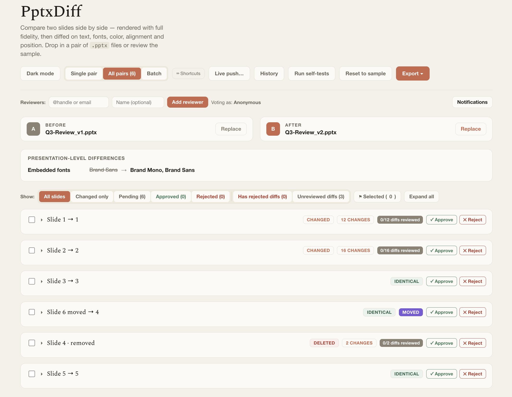

---
doc_coverage:
  - id: deck-level-comparison
    quality: complete
  - id: views
    quality: complete
    anchor: views
---

# Deck-level comparison

Real decks rarely line up 1:1 — slides get inserted, deleted, and reordered between revisions. PptxDiff aligns two whole decks before it diffs anything, so a single inserted slide near the top doesn't make every slide after it look "changed."

## How alignment works

1. **`alignSlides(A, B)`** — an LCS/Needleman-Wunsch-style alignment using per-slide word-overlap similarity (a Dice coefficient) to match slides between the Before and After decks, without letting one insertion/deletion cascade into misaligning everything downstream.
2. **`refineMoves(alignment, A, B)`** — a post-processing pass over the leftover, unmatched remove/add slides, re-matching them by content similarity (threshold > 0.55) to tell a genuinely **moved** slide (same content, different position) apart from a true add/remove.
3. **`markMovedByLIS(pairs)`** — the single source of truth for the MOVED tag: a global Longest-Increasing-Subsequence check over every matched `(beforeIndex, afterIndex)` pair, with a tie-break that prefers keeping same-position pairs out of the "moved" set when two equally-long reorderings are possible. Don't set `.moved` by hand anywhere else in the codebase — always route through this function.

## Status tags

Every matched or unmatched slide gets a primary tag, plus optional stackable secondary tags:

- **IDENTICAL** or **CHANGED** — always shown for matched pairs.
- **ADDED** / **DELETED** — for slides that exist on only one side.
- **MOVED** — an orthogonal tag shown alongside the primary tag when a slide's relative order changed (e.g. "CHANGED, MOVED").
- **DUPLICATE** — see [Duplicate detection](duplicate-detection.md); a slide can be both MOVED and a DUPLICATE at once.

## Views

- **Single pair** — two large slide previews (with prev/next steppers per side) plus the full diff list below, for focused review.
- **All pairs** — a grid of every aligned pair at once, compact previews on both sides, with filter chips (All / Changed only / Pending / Approved / Rejected / Has rejected diffs / Unreviewed diffs / Selected). Each card supports checkbox selection and a per-card collapse (hide the preview thumbnails, keep the header), plus a global "Collapse all / Expand all."
- **Batch** — see [Batch mode](batch-mode.md).

## Alignment tuning

The LCS match threshold and the `refineMoves` re-matching pass were tuned specifically so a whole reordered *section* of slides links pairwise in sequence, instead of cross-matching within the moved block via naive nearest-neighbor matching.
