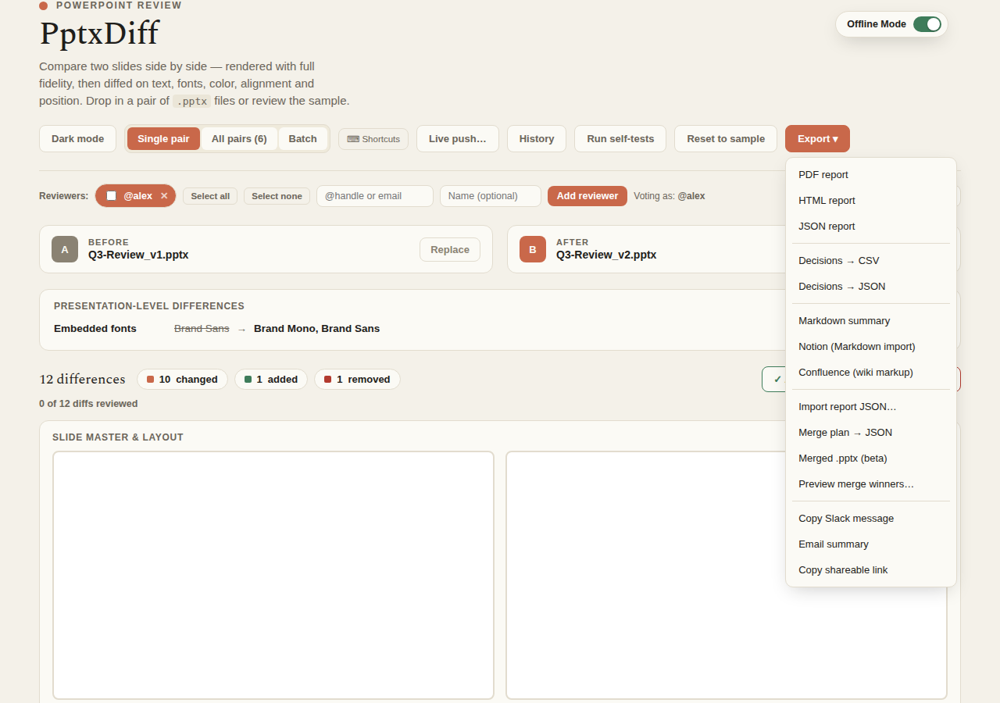

---
doc_coverage:
  - id: exports
    quality: complete
  - id: live-push
    quality: complete
    anchor: live-push
  - id: exports-limitations
    quality: complete
    anchor: sharing
---

# Exports & live push

Every export is built client-side from the same underlying report data (`buildReportRows()`), so formats stay consistent with each other.

## File exports

| Format | What you get |
|---|---|
| **PDF** | Print-to-PDF via `window.print()`, with chrome hidden through a `.no-print` class + `@media print` rules |
| **Standalone HTML report** | A downloaded, static, read-only summary of every diff/decision/comment — no app required to view it |
| **JSON report** | Deck names, presentation-level diffs, per-slide diffs, decisions, comments, history — plus a `uiState` block (`collapsedPairs`, `selectedPairs`, `mergeWinnerOverrides`) for full round-trip re-import |
| **Decisions → CSV / JSON** | Slide, decision, reviewer votes, comments |
| **Merge plan → JSON** | The per-diff Keep-Before/Keep-After/Custom picks |
| **Markdown summary** | A plain `.md` file with a table per slide |
| **Notion-flavored Markdown** | Same Markdown body, toasted with instructions for Notion's Settings → Import → Markdown flow |
| **Confluence wiki markup** | `h1./h2.` headings, `\|\|...\|\|` table syntax, toasted with instructions for Insert → Markup → Wiki Markup |

### Notion and Confluence are file exports, not live API pushes (for the file-export buttons)

Neither service exposes a public write API usable safely from a static, client-side page without a backend and OAuth — so these two export as files with an instructional toast, not a silent "success," matching this project's stance of never faking a live integration it can't actually deliver.

## Sharing

- **Copy Slack message** — copies a plain-text, mrkdwn-ish summary to your clipboard.
- **Email summary** — opens a `mailto:` link with a pre-filled subject and body.
- **Copy shareable link** — copies a self-contained `data:text/html;base64,...` URL of the HTML report to your clipboard. This is a data URL, not a hosted short link — there's no server to host one.

## Report round-trip import

**Import report JSON…** re-parses a previously-exported report and restores `decisions`, `comments`, `history`, and the `uiState` block. If your current session already has in-progress work, importing opens a **Merge / Overwrite / Cancel** choice instead of silently clobbering it:

- **Merge** — `mergeReportPatch(current, imported, conflictWinner)` unions comments and history (de-duplicated, history re-sorted newest-first), adopts anything only present in the import, and resolves conflicts (a reviewer's vote, a collapse/select/override flag) by whichever side you set as the winner — **Current session wins** (default) or **Imported file wins**.
- **Overwrite** — replaces the current session's state outright.

Older exports without a `key` field (from before round-trip import existed) are tolerated, not errored.

## Live push

A **Live push…** modal collects credentials (kept in component state only — explicitly never written to `localStorage`, and the modal says so) and attempts a real network call per service:

| Service | Mechanism | Reliability |
|---|---|---|
| **Slack** | Hidden `<form>` POST into a hidden `<iframe>` to your incoming-webhook URL | The `load`/`error` events give a real (if coarse) signal — this is the service most likely to actually succeed client-side |
| **Notion** | `PATCH /v1/blocks/{pageId}/children` with a bearer integration token, converting rows into real Notion blocks | Expected to usually fail with a CORS error from a static page — caught and reported clearly, pointing back at the Notion-Markdown file export as a working fallback |
| **Confluence** | `GET` the page (for version + body), then `PUT` an appended or replaced body in Confluence storage format, with HTTP Basic auth | Same CORS caveat/fallback message as Notion; a toggle controls **Append** (default, separated by `
`) vs. **Replace** |

Credential persistence is **opt-in and per-field** — a "Remember" checkbox next to each of the 7 fields (Slack webhook URL; Notion token/page ID; Confluence base URL/email/token/page ID) controls whether that one field is written to its own `localStorage` key (`slideDiffLivePushCreds_v1`, kept separate from the main reviewer-state key). Unchecking a field immediately drops just that field from storage. "Remember all" / "Forget all" buttons act on all 7 at once.
