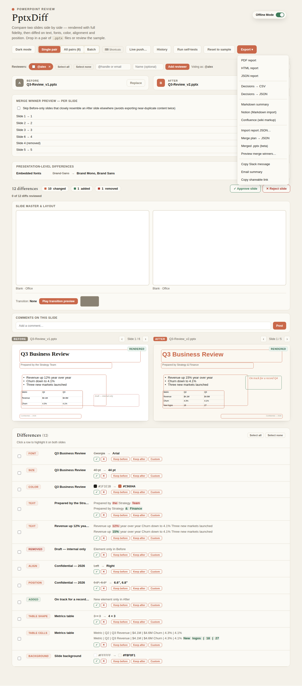

---
doc_coverage:
  - id: three-way-merge
    quality: complete
  - id: reviewer-workflow-limitations
    quality: complete
    anchor: why-not-a-full-ooxml-round-trip
---

# Three-way merge

PptxDiff can plan — and, in beta, actually produce — a merged deck from your Before/After diff decisions.

## Per-diff picks

For each individual diff within a slide, pick **Keep Before**, **Keep After**, or **Custom**. This is the same per-diff decision surface used for approve/reject in the [reviewer workflow](reviewer-workflow.md); merge reuses it rather than introducing a separate choice mechanism.

## Merge-winner preview

**Preview merge winners…** opens a panel listing every aligned slide with its computed Before/After/Dropped/New winner, computed by `pickMergeWinner` — the exact same function the real export uses — so what you preview is guaranteed to match what you'll download.

**Per-slide override**: force a specific slide's winner to Before or After regardless of the computed per-diff majority vote, labeled "(overridden)" in the preview. `pickMergeWinner` checks the override first.

**Skip near-duplicates**: a checkbox lets the preview (and the real export) skip Before-only slides that closely resemble an After slide elsewhere in the deck — see [Duplicate detection](duplicate-detection.md#interaction-with-merge).

## Real `.pptx` export (beta)

**Merged .pptx (beta)** produces a real, valid, openable `.pptx` file:

1. For each aligned slide pair, tally that slide's Keep-Before/Keep-After per-diff picks — majority wins; ties default to After.
2. Convert the winning parsed slide back into `buildPptx`'s spec shape via `slideToBuildSpec`.
3. Download the result.

**Scope of what carries over**: text, tables, background, notes, and transitions are re-embedded. **Images, charts, SmartArt, and media are dropped** — only a content hash/reference was ever kept for those during parsing, not re-embeddable bytes. A toast states this plainly at export time, so it's never a silent surprise.

## Why not a full OOXML round-trip?

A real auto-merge of arbitrary uploaded files that preserves every asset losslessly would need a full round-trip OOXML writer capable of re-serializing anything it can read — a much larger undertaking than this tool's scope. The merge feature is explicitly a **planning tool with a real (beta), scope-limited export**, not a guarantee of pixel-for-pixel, asset-for-asset fidelity. See [Limitations](../limitations.md).
