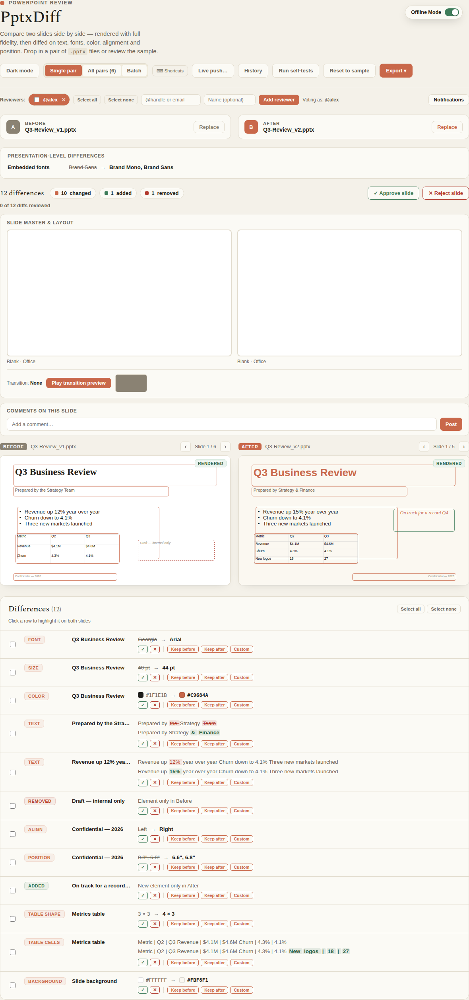

---
doc_coverage:
  - id: reviewer-workflow
    quality: complete
  - id: reviewer-workflow-limitations
    quality: partial
    anchor: persistence
---

# Reviewer workflow

PptxDiff isn't just a diff viewer — it's built for a team to actually sign off on a deck revision together, all client-side (state lives in `localStorage`, nothing is sent to a server).

## Reviewers

Add a reviewer with a required `@handle` or email plus an optional display name; each becomes a removable chip. Click a chip to set who you're currently "voting as."

## Approvals

- **Per-slide** Approve/Reject, tracked **per reviewer** — `decisions[pairKey][handle]`. The slide-level aggregate status is: rejected if *any* reviewer rejected, else approved if *any* reviewer approved, else pending.
- **Per-diff** Approve/Reject — the same idea, but scoped to one individual diff within a slide (not the whole slide), keyed `pairKey::diffKey`, also tracked per reviewer.
- A rollup badge on each slide (single view and All-pairs) shows "X of Y diffs reviewed," and All-pairs filter chips let you jump straight to "Has rejected diffs" or "Unreviewed diffs."

## Comments

Per-slide comments support threaded replies: `comments[pairKey] = [{author, text, ts, replies: [...]}]`. Comments and individual replies can each be deleted (with confirmation — see below); bulk delete/select-all is available too.

## @mentions

Mentioning a registered `@handle` in a comment or reply queues an in-app notification — a bell icon (with an unread badge) next to "Voting as" surfaces them, marked read on open. This is in-session only: there's no push/email delivery, since the app has no backend.

## History log

A newest-first, toggleable panel records every approve/reject/comment/reply with reviewer and timestamp — a full audit trail of the review session.

## Clearing decisions

A "Clear decisions ▾" dropdown offers four scopes:

- **All** — every reviewer, every slide.
- **Only my votes** — just the active reviewer's votes; other reviewers' votes on the same slides are kept.
- **Specific reviewer** — pick a handle (autocompleted from the current reviewer list), clear just theirs.
- **Specific slide range** — a row-position range *as shown in the All-pairs view* (not Before/After slide numbers) — clears every reviewer's votes, but only for slides in that range.

This only ever touches `decisions` (slide-level approve/reject) — it never touches `diffDecisions` (the per-diff picks used by merge), comments, or history.

## Destructive actions are confirmed

Every bulk or otherwise-unrecoverable action — removing selected reviewers, deleting selected comments, clearing selected history, deleting a single comment, removing a batch file, clearing all decisions — routes through one shared confirmation modal (`pendingConfirm` state, `openConfirm`/`closeConfirm`/`confirmPendingYes`) so the "are you sure?" experience is consistent everywhere. Smaller, more easily-undone actions (a single reviewer's ✕, a single reply's ✕) stay immediate by design.

## Persistence

Reviewers, the active reviewer, per-slide decisions, comments + replies, the history log, per-diff decisions, and merge choices are saved to `localStorage` (key `slideDiffReviewerState_v1`) after every mutation and restored automatically the next time you open the app — your review session survives a page reload.
