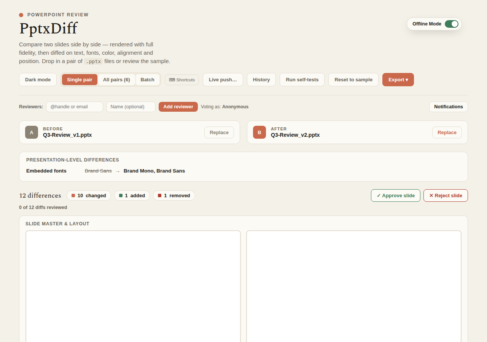

---
doc_coverage:
  - id: npm-cli-packaging
    quality: partial
  - id: offline-capability
    quality: partial
    anchor: requirements
  - id: static-sample-fixtures
    quality: complete
    anchor: try-it-with-the-bundled-sample-files
  - id: native-binaries
    quality: partial
    anchor: option-d-standalone-binary-no-nodejs-at-all
---

# Getting started

PptxDiff ships four equivalent ways to run it — pick whichever fits your workflow. All four serve the exact same `src/pptxdiff/index.html` app; none of them upload your files anywhere.

## Option A — npx (no install)

```bash
npx pptxdiff
```

Starts a local static server on an OS-assigned free port and opens the app in your default browser. Nothing is installed globally.

## Option B — npm (global install)

```bash
npm install -g pptxdiff
pptxdiff
```

Same server/browser behavior as `npx`, but installed once so the `pptxdiff` command stays on your `$PATH`.

## Option C — just the file (no npm at all)

```bash
git clone https://github.com/sugatoray/pptxdiff.git
cd pptxdiff
open src/pptxdiff/index.html   # or double-click it, or serve the folder statically
```

Works even without Node — `index.html` is self-contained, and needs no internet connection to run (see below).

## Option D — standalone binary (no Node.js at all)

```bash
./pptxdiff-linux      # or pptxdiff-mac / pptxdiff-mac-arm64 / pptxdiff-win.exe, etc.
```

A native, standalone executable per OS+chip — download one file from a
[GitHub Actions build](https://github.com/sugatoray/pptxdiff/actions/workflows/binaries.yml)
and run it directly. No Node.js install of any kind, not even the `npx`/`npm`
step Options A/B still need. Six targets exist (x64 and arm64 for each of
Windows, macOS, and Linux) — see the [`@pptxdiff/binaries` package
README](https://github.com/sugatoray/pptxdiff/blob/master/src/packages/binaries/README.md)
for exactly which file to pick and how to build them yourself.

This is a genuine single file (the Node runtime and the app's static assets
are both embedded inside it via [`@yao-pkg/pkg`](https://github.com/yao-pkg/pkg))
running the exact same, unmodified `bin/cli.js` Options A/B run — same local
server, same loopback binding, same [security properties](cli.md#security-note).

!!! warning "Not code-signed"
    There's no code-signing certificate for this project yet, so Windows
    SmartScreen and macOS Gatekeeper will both warn on a freshly-downloaded
    copy — see each OS folder's own README for how to proceed anyway
    (`pptxdiff-{win,mac,linux}/README.md` in the repo). Not attached to a
    tagged GitHub Release yet either; download from the Actions run's
    workflow artifacts for now.

## What happens on first load

The app ships a built-in **sample deck** — `sample-pptx.js` generates a Before/After pair on load — so you can try every feature immediately, with nothing to upload. Drop in your own `.pptx` pair whenever you're ready, or click **Reset to sample** to go back to the demo data.



## Requirements

- **Node.js ≥ 18** if you're using the `npx`/`npm` install paths (see `engines` in `package.json`). Not needed at all for Option D (standalone binary) — the Node runtime is embedded inside it.
- **No internet connection required, for any install option.** React, ReactDOM, Babel-standalone, `@aiden0z/pptx-renderer`, JSZip, and fonts are all vendored locally under `src/pptxdiff/vendor/` and loaded from disk, not from a CDN. The app works fully offline/air-gapped by default — an opt-in `PPTXDIFF_LITE_MODE` switches back to CDN sourcing if you ever want that; see the [CLI reference](cli.md#lite-mode-cdn-sourcing).
- **Your `.pptx` files never leave your machine.** Parsing, rendering, and diffing all happen client-side, in your browser's memory.

## Try it with the bundled sample files

Real, on-disk sample decks (not just the in-browser demo) are checked into the repo at `docs/assets/sample_before.pptx` / `docs/assets/sample_after.pptx`. Upload that pair directly if you want to exercise the diff engine on real files without clicking "Reset to sample" first — useful for the CLI/static-file install paths, or for a quick smoke test after you clone.

## Development

Run the CLI straight from source, no install/build step:

```bash
git clone https://github.com/sugatoray/pptxdiff.git
cd pptxdiff
node bin/cli.js
```

To exercise it exactly as if it were installed (e.g. to test the `pptxdiff` command itself):

```bash
npm link
pptxdiff
npm unlink -g pptxdiff   # when done
```

## Project structure

```text
bin/cli.js                    # npm CLI entry point — local static server + opens your browser
package.json                  # npm package manifest (bin, files, no runtime dependencies)
src/pptxdiff/index.html       # the whole application (template + logic, self-contained)
src/pptxdiff/support.js       # runtime the app is authored against (pinned; don't casually upgrade)
src/pptxdiff/sample-pptx.js   # builds the in-browser sample/test-fixture .pptx files
src/pptxdiff/vendor/          # vendored React/ReactDOM/Babel/JSZip/pptx-renderer/fonts (offline-capable, no CDN)
src/pptxdiff/docs-site/       # this documentation site (MkDocs + Material)
```

## Not open to contributions

This project currently isn't accepting external contributions — feel free to [open an issue](https://github.com/sugatoray/pptxdiff/issues) on GitHub instead. See the repository's `CLAUDE.md` for the AI-driven development process used to build it.

## Next steps

- [Feature walkthrough](features/index.md) — a guided tour of everything the app can do.
- [CLI reference](cli.md) — flags, ports, and what `bin/cli.js` actually does.
- [Architecture](architecture.md) — why it's one file, and what that trades off.
